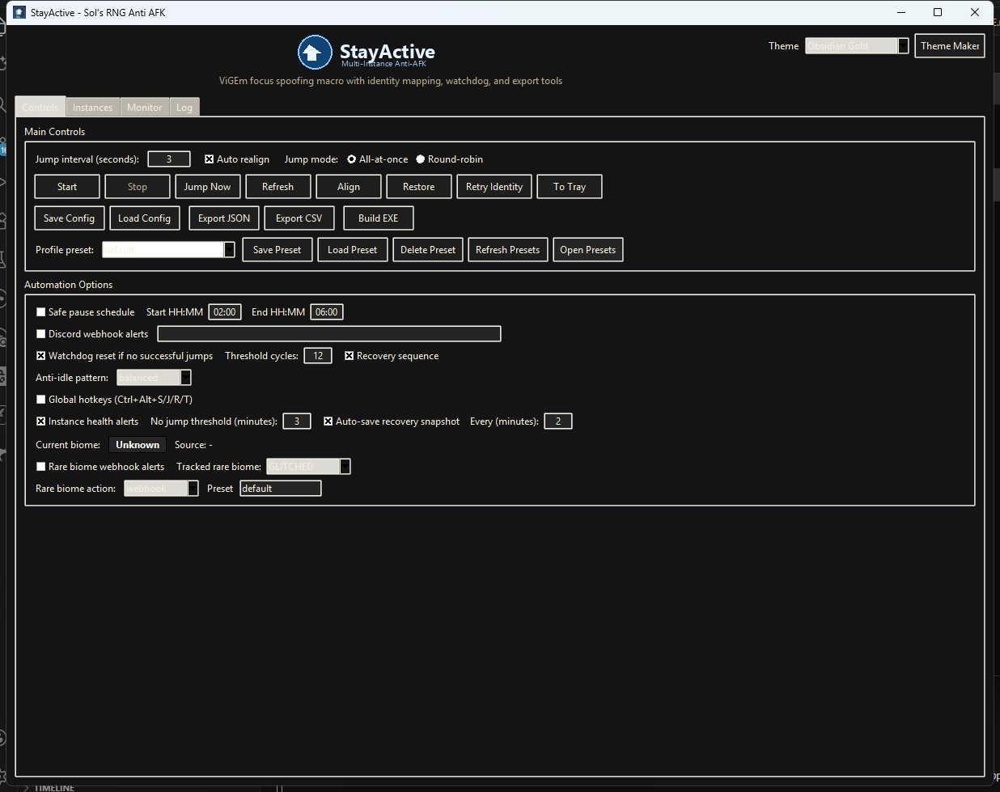

<p align="center">
  
</p>

<h1 align="center">StayActive</h1>

<p align="center">
  Multi-instance Sol's RNG anti-AFK tool for Windows with focus spoofing, identity mapping, biome tracking, and robust diagnostics.
</p>

<p align="center">
  <a href="https://github.com/0bl1terate3/StayActive/releases/latest"></a>
  <a href="https://github.com/0bl1terate3/StayActive/releases"></a>
  <a href="https://github.com/0bl1terate3/StayActive/releases/latest"></a>
  <a href="https://github.com/0bl1terate3/StayActive/stargazers"></a>
  <a href="https://github.com/0bl1terate3/StayActive/issues"></a>
</p>

<p align="center">
  <a href="https://github.com/0bl1terate3/StayActive/releases/latest"><b>Download Latest EXE</b></a>
  |
  <a href="https://discord.gg/MSVrKb5B9N"><b>Support Discord</b></a>
  |
  <a href="#quick-start"><b>Quick Start</b></a>
  |
  <a href="FIXLOG.md"><b>Fix Log</b></a>
  |
  <a href="#build-exe"><b>Build From Source</b></a>
</p>

<p align="center">
  
  
  
  
</p>



<table>
  <tr>
    <td>
      <b>What this is</b><br/>
      StayActive is a multi-instance Roblox anti-AFK desktop tool focused on reliability, visibility, and control.
    </td>
    <td>
      <b>What you get</b><br/>
      Focus spoofing, per-instance toggles, identity/biome monitoring, webhook alerts, diagnostics, and export tools.
    </td>
  </tr>
</table>

---

## Why StayActive

- Handles multiple Roblox instances with per-instance control.
- Automatically closes Roblox singleton event handles on launch, so you can run multiple Roblox instances at the same time natively.
- Sends anti-AFK jumps with focus spoofing (`All-at-once` and `Round-robin`).
- Tracks identity + avatars and gives confidence labels for lookups.
- Includes biome monitoring, rare-biome webhook alerts, and diagnostics export.
- Ships with quality-of-life tools: window align/restore, presets, header theme dropdown, updater checks, and tray support.
- Includes a dedicated Performance tab with a Roblox process limiter for low-CPU multi-account setups.

<table>
  <tr>
    <th>Control</th>
    <th>Observability</th>
    <th>Automation</th>
  </tr>
  <tr>
    <td>Per-instance enable/disable</td>
    <td>Biome badge and history</td>
    <td>Interval jump loop</td>
  </tr>
  <tr>
    <td>Grid align and restore</td>
    <td>Identity confidence + avatars</td>
    <td>Round-robin/all-at-once modes</td>
  </tr>
  <tr>
    <td>Preset profiles</td>
    <td>Diagnostics + debug bundle</td>
    <td>Watchdog + safe pause schedule</td>
  </tr>
</table>

## Requirements

- Windows 10/11
- ViGEmBus driver: <https://vigembus.com/>
- Python 3.10+ (recommended for local build/runtime)

## Quick Start

```powershell
python -m venv .venv
.\.venv\Scripts\Activate.ps1
pip install -r requirements.txt
python main.py
```

Optional tray support:

```powershell
pip install pystray pillow
```

> Tip  
> Use the latest GitHub release EXE if you do not need source edits.

## Highlights

- Multi-instance detection with enable/disable toggles per window.
- Automatic singleton-event cleanup when Roblox opens, enabling native multi-instance launches.
- Focus-spoofed jump dispatch via ViGEmBus + `vgamepad`.
- Biome badge/history + rare biome Discord webhook alerts.
- Header theme dropdown with many distinct color themes.
- In-app Theme Maker with custom theme save/delete and live preview.
- Theme Maker import/export for shareable JSON theme files.
- First-launch Quick Setup Wizard for baseline configuration.
- Global hotkeys (`Ctrl+Alt+S/J/R/T`) for start/stop, jump, refresh, and tray.
- Instance health alerts when enabled instances stop receiving jumps.
- Auto-save recovery snapshots with restore prompt after unclean shutdown.
- One-click clipboard support bundle for faster troubleshooting.
- Smart anti-idle patterns: `balanced`, `subtle`, `aggressive`, `randomized`.
- Identity detection from logs with Roblox API enrichment.
- Improved identity mapping reliability with stronger log matching and username/userId pairing.
- Session stats, watchdog recovery sequence, and safe pause schedule.
- Performance tab with process limiter controls (target %, cycle ms, run-only gate, and resume-all).
- Auto limiter mode for instant 0% freeze behavior with no calibration.
- Limiter status panel + per-process state table (active/suspended/boosted).
- In-app update checks + release page shortcut.
- Config/preset validation improvements (pause schedule + webhook URL checks).
- Config save/load, portable bundle import/export, JSON/CSV export, and debug bundle export.
- Dedicated StayActive header logo for clearer branding/readability.
- Event timeline panel and copy-to-clipboard diagnostics utilities.
- Rules MVP (Phase 1): in-process trigger/condition/action automation with cooldown/debounce and compact runtime status.
- Identity Reliability Center (Phase 2 MVP): per-instance confidence reasons, conflict/retry telemetry, quick retry/clear actions, and session-only PID→identity pinning.
- Relaunch Playbooks + tracing (Phase 3 MVP): Conservative/Balanced/Aggressive presets, cooldown pacing, and explainable relaunch decision reasons exported in diagnostics/support bundles.
- **Rules Engine Phase 2**: Visual Rule Builder dialog, composite AND/OR conditions, and new actions (`play_sound`, `close_instance`, `run_script`).
- **Identity Center (v0.1.8)**: Persistent identity pins across restarts, instance aliasing/renaming, and save/clear pin controls.
- **Per-Account Performance Profiles**: Account-specific duty-cycle overrides and Smart Freeze (auto-unfreeze foreground Roblox window).
- **Roblox Error Screen Detection**: Auto-detects error codes 277/268/279/264 and terminates for relaunch.
- **Private Server Auto-Rejoin**: Deep-link relaunch using configured place ID + link code.
- **Session Analytics Dashboard**: Dedicated Analytics tab with 24h event timeline, summary stats, and uptime graph.
- **Discord Rich Presence**: Optional RPC integration showing account count and uptime on your Discord profile.
- **In-App Seamless Updating**: One-click download, replace, and restart from within the app.
- **Relaunch Webhook Channel**: Dedicated webhook URL for relaunch-specific notifications.

## Rules Engine (Phase 2)

Rules mode adds a lightweight in-process automation layer driven by normalized app events.

- Event normalization shape:
  - `type` (event identifier)
  - `category` (domain bucket)
  - `severity` (`debug|info|warning|error|critical`)
  - `timestamp` (UTC ISO-8601)
  - `source` (emitter identity)
  - `payload` (event-specific data)
- Rules engine capabilities:
  - Trigger matching (`type/category/severity/source`, optional `type_prefix`, optional message `contains`)
  - Optional condition checks (`runtime_running`, payload-key checks with `equals`/`not_equals`/`in`, optional `contains`)
  - **Composite conditions** (v0.1.8): `and` / `or` blocks for combining multiple condition checks
  - Actions:
    - `send_webhook`
    - `load_preset`
    - `pause` / `pause_for_minutes`
    - `resume` / `clear_pause`
    - `play_sound` (v0.1.8)
    - `close_instance` (v0.1.8)
    - `run_script` (v0.1.8)
  - Cooldown and debounce controls per rule (`cooldown_seconds`, `debounce_seconds`)
- **Visual Rule Builder** (v0.1.8): GUI dialog for creating rules with dropdowns for triggers, conditions, and actions — no JSON editing required.

### Usage

- Open **Dashboard → Automation → Rules Engine**.
- Enable **Rules mode** to activate evaluation.
- Click **Visual Rule Builder** to create rules interactively.
- Optionally enable **Verbose rule logs** for skip reasons (cooldown/debounce).
- Rules definitions are persisted in config under `rules_definitions` and validated on load.

### Constraints

- Rules are **default-off** and do not alter behavior until enabled.
- Rules run in-process and are intentionally minimal for stability.
- Invalid rule entries are ignored during load normalization.
- `run_script` executes shell commands — use with care and only with trusted scripts.

## Identity Reliability Center (Phase 2 MVP)

- Added a compact **Instances → Identity Reliability Center (MVP)** panel that shows:
  - selected PID confidence label + confidence reason
  - conflict count and latest conflict reason
  - retry count and latest retry timing
  - session pin state
- Added quick actions for selected rows:
  - **Retry Identity**
  - **Clear Identity Cache**
  - **Pin Session** / **Unpin Session**
- Session pins are in-memory only by default and are auto-invalidated when the PID exits.
- **Persistent pins** (v0.1.8): Optionally persist identity pins across restarts with save/clear controls.
- **Instance aliasing** (v0.1.8): Rename instances with custom labels that persist by username.

## Per-Account Performance Profiles (v0.1.8)

- Assign account-specific duty-cycle overrides (target %, cycle ms) via the **Per-Account Profiles** editor.
- **Smart Freeze**: Automatically unfreezes the foreground Roblox window and freezes background instances for seamless interaction.
- Profiles are keyed by username and persist across config save/load.

## Error Screen Detection & Private Server Rejoin (v0.1.8)

- **Error screen detection**: Scans Roblox window titles for error codes `277`, `268`, `279`, `264` and auto-terminates affected instances for relaunch.
- **Private server auto-rejoin**: When a place ID and link code are configured, relaunched instances use a `roblox://` deep link to rejoin the same private server automatically.
- Detection runs on the main poll loop and respects a per-PID cooldown to avoid spam.

## Session Analytics (v0.1.8)

- Dedicated **Analytics** tab with:
  - Session summary (uptime, biome changes, crashes/relaunches, jump cycles, total events)
  - Scrollable event timeline (last 100 events, newest first)
  - Uptime graph (last 24h) rendered on a canvas
- All internal events are automatically fed into the analytics store.
- Auto-refreshes every ~10 seconds; manual refresh button also available.

## Discord Rich Presence (v0.1.8)

- Optional toggle in **Alerts** tab to show StayActive status on your Discord profile.
- Displays account count and session uptime via Discord IPC.
- Automatically connects/disconnects; cleanly disconnects on app close.

## In-App Seamless Updating (v0.1.8)

- **Update & Restart** button in the Quick Start action bar.
- Downloads the latest release EXE from GitHub, replaces the current binary, and restarts the app.
- Falls back to opening the release page if the seamless flow fails.

## Relaunch Playbooks + Decision Tracing (Phase 3 MVP)

- Added relaunch strategy presets mapped to existing controls:
  - `conservative` → higher grace, lower launch cap, longer cooldown pacing
  - `balanced` → default behavior
  - `aggressive` → shorter grace, higher launch cap, shorter cooldown pacing
- Added **Relaunch cooldown (s)** as an explicit pacing control used by playbooks and custom mode.
- Added decision tracing for relaunch state transitions (`no-op`, `cooldown`, `launch`, `cap`).
- Latest relaunch reason is surfaced in UI and included in diagnostics/support artifacts.
- Debug/support exports now include structured relaunch trace + identity telemetry snapshots.

## Patch Notes (v0.1.8)

- Added **Rules Engine Phase 2** with Visual Rule Builder dialog, composite AND/OR conditions, and new actions (`play_sound`, `close_instance`, `run_script`).
- Added **Identity Center (v0.1.8)** with persistent identity pins across restarts, instance aliasing/renaming, and save/clear pin management.
- Added **Per-Account Performance Profiles** with account-specific duty-cycle overrides and a dedicated editor dialog.
- Added **Smart Freeze** that auto-unfreezes the foreground Roblox window and freezes background instances.
- Added **Roblox Error Screen Detection** for error codes 277/268/279/264 with auto-terminate for relaunch.
- Added **Private Server Auto-Rejoin** using `roblox://` deep links when place ID and link code are configured.
- Added **Session Analytics Dashboard** (new Analytics tab) with 24h event timeline, summary stats, and uptime graph.
- Added **Discord Rich Presence** integration showing account count and session uptime on your Discord profile.
- Added **In-App Seamless Updating** with one-click download, replace, and restart.
- Added dedicated **Relaunch Webhook URL** channel for relaunch-specific notifications.
- Added relaunch webhook notifications on both roster-based and count-based relaunch events.
- All internal events now feed into the analytics store for unified session visibility.
- Analytics auto-refreshes every ~10 seconds alongside the stats update loop.
- Persistent pins are loaded on startup and saved on close when enabled.
- Discord RPC cleanly disconnects on app close.
- Config save/load updated to persist all new v0.1.8 settings.

## Patch Notes (v0.1.7)

- Added **Rules MVP (Phase 1)** with normalized internal event envelopes (`type/category/severity/source/timestamp/payload`) and in-process trigger → condition → action execution.
- Added Rules safeguards and operator controls: enable/disable toggle, verbose rule logging, cooldown/debounce handling, compact status panel, and recent rule execution visibility.
- Added **Identity Reliability Center (Phase 2 MVP)** for selected instances with confidence reasons, conflict/retry telemetry, and quick actions (retry, clear cache, session pin/unpin).
- Added session-only identity pinning safeguards (PID-scoped, auto-invalidated on process exit, intentionally not persisted across restart).
- Added **Relaunch Playbooks (Phase 3 MVP)** (`conservative`, `balanced`, `aggressive`) plus explicit relaunch cooldown pacing.
- Added explainable relaunch decision tracing (`no-op`, `cooldown`, `launch`, `cap`) surfaced in UI and exported in diagnostics/support artifacts.
- Expanded diagnostics/support exports with identity telemetry and relaunch trace snapshots for faster troubleshooting.
- Updated webhook test popup behavior on this path to use an error-style dialog as requested.

## Patch Notes (v0.1.6)

- Rolls up the post-`v0.1.5` hotfix train into a stable bundled release.
- Fixed multi-instance identity resolution conflicts and reduced race conditions in identity refresh passes.
- Improved conflict handling so duplicate username/userId mappings are flagged as `conflict` and retried cleanly.
- Hardened crash-reporting thread safety by avoiding direct Tk widget reads from background threads.
- Hardened identity worker exception handling to prevent lookup failures from destabilizing the UI flow.
- Added hotkey safety lock behavior to block `Start/Stop` and `To Tray` hotkeys while Roblox is focused (when enabled).
- Stabilized singleton cleanup by bounding per-PID cleanup retries.
- Added watchdog auto-relaunch controls for dropped instances (grace window + hourly cap).

For granular entries captured during hotfixing, see `FIXLOG.md`.

## Patch Notes (v0.1.5)

- Added a new **Performance** tab with a full Roblox process limiter.
- Added duty-cycle limiting controls: target active time (%) and cycle length (ms).
- Added **Auto mode** that forces immediate 0% freeze behavior (no manual calibration).
- Added persistent freeze targeting across Roblox process scans so 0% mode does not drop when window detection flickers.
- Added limiter safety controls: **Only while macro is running** and **Resume All**.
- Added per-process limiter state visibility (PID, state, boost window, title).
- Added limiter diagnostics output in the checks panel and support bundle text.
- Added limiter config persistence to normal config + preset save/load.
- Added runtime setting sync so UI changes are reflected consistently in active loop behavior.
- Added input-aware Roblox auto-pause (detects active user input and briefly backs off virtual input sends).
- Added per-window recovery tiers/backoff tracking to reduce repeated send-failure spam and improve stability.
- Added safer window targeting with short-lived scan caching and improved round-robin/weighted scheduling flow.
- Added config/preset hardening: config schema normalization, invalid config backup, and atomic JSON writes.
- Moved runtime data/config storage to `%LOCALAPPDATA%\\StayActive` with migration of legacy files on startup.
- Added thread-safety improvements for UI logging/event updates and bounded in-app log retention.
- Added portable import integrity checks (checksum validation from metadata when present).
- Updated PyInstaller spec output metadata to `StayActive` naming and admin manifest settings.

For targeted hotfix details after release, see `FIXLOG.md`.

## Previous Notes (v0.1.4)

- You can now open multiple Roblox instances at the same time natively. StayActive closes the Roblox singleton lock automatically when Roblox starts.
- Multi-instance startup is more reliable. If Roblox recreates the lock, StayActive retries quickly in the background.
- Account detection is more accurate, so usernames and avatars are less likely to be mismatched between instances.
- The app now gives clearer startup and cleanup logs, making it easier to see what happened if something fails.

- Added Theme Maker (create, preview, save, and delete custom color themes).
- Added custom theme persistence in `stayactive_themes.json`.
- Added dedicated header logo asset for improved header clarity.
- Included custom themes in portable export/import and debug bundle exports.
- Added official support Discord link: `https://discord.gg/MSVrKb5B9N`.
- Added StayActive wiki-ready page content and macro list update (`macros.md`).

## Build EXE

Fast path (recommended):

```powershell
py -3.10 -m pip install --upgrade pyinstaller vgamepad pystray pillow
py -3.10 -m PyInstaller --noconfirm --clean --onefile --windowed --uac-admin --name StayActive --add-data "STAYACTIVE ICON.png;." --collect-binaries vgamepad --collect-data vgamepad --collect-submodules vgamepad main.py
```

Standard path:

```powershell
python -m PyInstaller --noconfirm --clean --onefile --windowed --uac-admin --name StayActive --add-data "STAYACTIVE ICON.png;." --collect-binaries vgamepad --collect-data vgamepad --collect-submodules vgamepad main.py
```

Output: `dist/StayActive.exe`

## Release (maintainer flow)

After building and validating `dist/StayActive.exe`, publish the release from repo root:

```powershell
git tag v0.1.8
git push origin main
git push origin v0.1.8
gh release create v0.1.8 dist/StayActive.exe --title "StayActive v0.1.8" --notes-file RELEASE_NOTES_v0.1.8.md
```

## Troubleshooting

- If the app process exists but no window appears:
  Ensure ViGEmBus is installed and running.
  Use the latest release build (`v0.1+`) which includes startup/import fixes and QoL diagnostics improvements.
- If PyInstaller hangs on Python 3.14:
  Build with Python 3.10 (`py -3.10`) as shown above.

## Safety

Use StayActive responsibly and at your own risk. You are responsible for compliance with game/platform rules and account safety.

