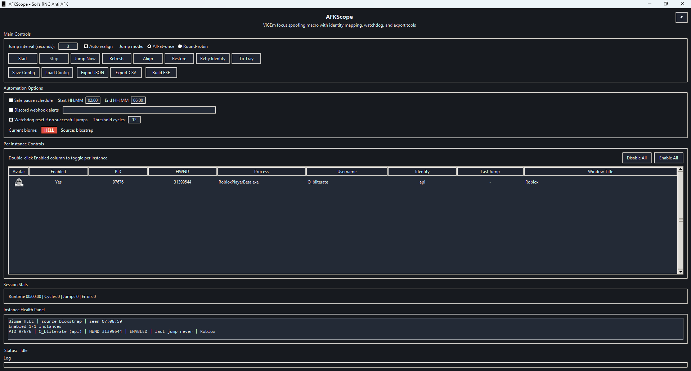

<p align="center">
  
</p>

<h1 align="center">AFKScope</h1>

<p align="center">
  Multi-instance Sol's RNG anti-AFK macro for Windows using ViGEmBus + vgamepad.
</p>

<p align="center">
  <a href="https://github.com/0bl1terate3/AFKScope/releases/latest"></a>
  <a href="https://github.com/0bl1terate3/AFKScope/releases"></a>
  <a href="https://github.com/0bl1terate3/AFKScope/releases/latest"></a>
  <a href="https://github.com/0bl1terate3/AFKScope/stargazers"></a>
  <a href="https://github.com/0bl1terate3/AFKScope/issues"></a>
</p>

<p align="center">
  <a href="https://github.com/0bl1terate3/AFKScope/releases/latest"><b>Download Latest EXE</b></a>
</p>



## Features

- Multi-instance Roblox detection with per-instance enable/disable.
- Focus spoofed jump dispatch on timer (`All-at-once` and `Round-robin`).
- Window align grid + one-click restore.
- Username identity detection, confidence state, and avatar headshots.
- Biome tracking with colored badge + health panel reporting.
- Session stats, watchdog reset, safe pause schedule, and webhook alerts.
- Config save/load and JSON/CSV export.
- Light/dark mode with smooth animated transition.
- Optional tray controls (`pystray` + `pillow`).

## Requirements

- Windows
- Python 3.10+
- ViGEmBus driver: https://vigembus.com/

## Install

```powershell
python -m venv .venv
.\.venv\Scripts\Activate.ps1
pip install -r requirements.txt
```

Optional tray support:

```powershell
pip install pystray pillow
```

## Run

```powershell
python main.py
```

## Build EXE

```powershell
python -m PyInstaller --noconfirm --clean --onefile --windowed --name AFKScope --icon "AFKSCOPE ICON.ico" --add-data "AFKSCOPE ICON.ico;." --collect-binaries vgamepad --collect-data vgamepad --collect-submodules vgamepad main.py
```

