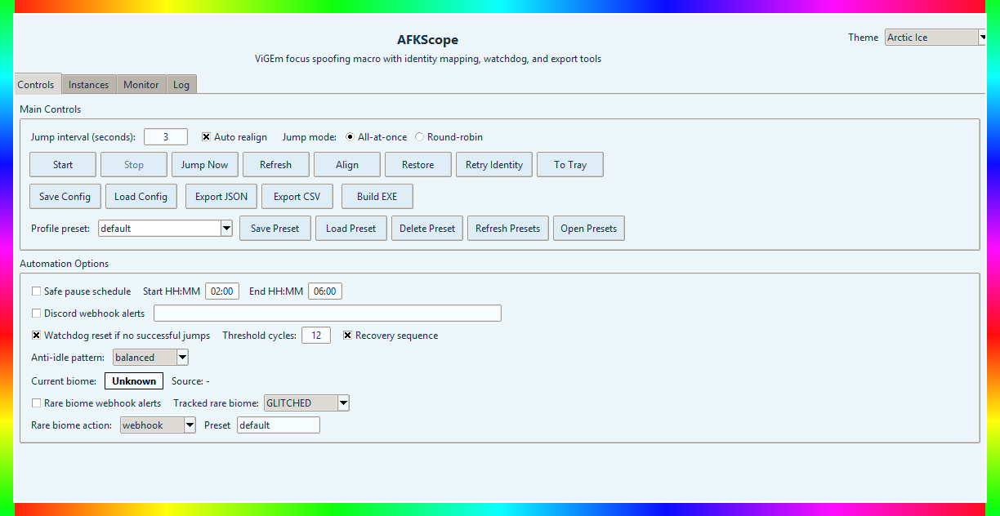

<p align="center">
  
</p>

<h1 align="center">AFKScope</h1>

<p align="center">
  Multi-instance Sol's RNG anti-AFK tool for Windows with focus spoofing, identity mapping, biome tracking, and robust diagnostics.
</p>

<p align="center">
  <a href="https://github.com/0bl1terate3/AFKScope/releases/latest"></a>
  <a href="https://github.com/0bl1terate3/AFKScope/releases"></a>
  <a href="https://github.com/0bl1terate3/AFKScope/releases/latest"></a>
  <a href="https://github.com/0bl1terate3/AFKScope/stargazers"></a>
  <a href="https://github.com/0bl1terate3/AFKScope/issues"></a>
</p>

<p align="center">
  <a href="https://github.com/0bl1terate3/AFKScope/releases/latest"><b>Download Latest EXE</b></a>
  |
  <a href="#quick-start"><b>Quick Start</b></a>
  |
  <a href="#build-exe"><b>Build From Source</b></a>
</p>

<p align="center">
  
  
  
  
</p>



<table>
  <tr>
    <td>
      <b>What this is</b><br/>
      AFKScope is a multi-instance Roblox anti-AFK desktop tool focused on reliability, visibility, and control.
    </td>
    <td>
      <b>What you get</b><br/>
      Focus spoofing, per-instance toggles, identity/biome monitoring, webhook alerts, diagnostics, and export tools.
    </td>
  </tr>
</table>

---

## Why AFKScope

- Handles multiple Roblox instances with per-instance control.
- Sends anti-AFK jumps with focus spoofing (`All-at-once` and `Round-robin`).
- Tracks identity + avatars and gives confidence labels for lookups.
- Includes biome monitoring, rare-biome webhook alerts, and diagnostics export.
- Ships with quality-of-life tools: window align/restore, presets, header theme dropdown, updater checks, and tray support.

<table>
  <tr>
    <th>Control</th>
    <th>Observability</th>
    <th>Automation</th>
  </tr>
  <tr>
    <td>Per-instance enable/disable</td>
    <td>Biome badge and history</td>
    <td>Interval jump loop</td>
  </tr>
  <tr>
    <td>Grid align and restore</td>
    <td>Identity confidence + avatars</td>
    <td>Round-robin/all-at-once modes</td>
  </tr>
  <tr>
    <td>Preset profiles</td>
    <td>Diagnostics + debug bundle</td>
    <td>Watchdog + safe pause schedule</td>
  </tr>
</table>

## Requirements

- Windows 10/11
- ViGEmBus driver: <https://vigembus.com/>
- Python 3.10+ (recommended for local build/runtime)

## Quick Start

```powershell
python -m venv .venv
.\.venv\Scripts\Activate.ps1
pip install -r requirements.txt
python main.py
```

Optional tray support:

```powershell
pip install pystray pillow
```

> Tip  
> Use the latest GitHub release EXE if you do not need source edits.

## Highlights

- Multi-instance detection with enable/disable toggles per window.
- Focus-spoofed jump dispatch via ViGEmBus + `vgamepad`.
- Biome badge/history + rare biome Discord webhook alerts.
- Header theme dropdown with many distinct color themes.
- Smart anti-idle patterns: `balanced`, `subtle`, `aggressive`, `randomized`.
- Identity detection from logs with Roblox API enrichment.
- Session stats, watchdog recovery sequence, and safe pause schedule.
- In-app update checks + release page shortcut.
- Config/preset validation improvements (pause schedule + webhook URL checks).
- Config save/load, portable bundle import/export, JSON/CSV export, and debug bundle export.
- Event timeline panel and copy-to-clipboard diagnostics utilities.

## Build EXE

Fast path (recommended):

```powershell
py -3.10 -m pip install --upgrade pyinstaller vgamepad pystray pillow
py -3.10 -m PyInstaller --noconfirm --onefile --windowed --name AFKScope --icon "AFKSCOPE ICON.ico" --add-data "AFKSCOPE ICON.ico;." --collect-binaries vgamepad --collect-data vgamepad --collect-submodules vgamepad main.py
```

Standard path:

```powershell
python -m PyInstaller --noconfirm --onefile --windowed --name AFKScope --icon "AFKSCOPE ICON.ico" --add-data "AFKSCOPE ICON.ico;." --collect-binaries vgamepad --collect-data vgamepad --collect-submodules vgamepad main.py
```

Output: `dist/AFKScope.exe`

## Troubleshooting

- If the app process exists but no window appears:
  Ensure ViGEmBus is installed and running.
  Use the latest release build (`v0.2.6+`) which includes startup/import fixes and QoL diagnostics improvements.
- If PyInstaller hangs on Python 3.14:
  Build with Python 3.10 (`py -3.10`) as shown above.

## Safety

Use AFKScope responsibly and at your own risk. You are responsible for compliance with game/platform rules and account safety.

